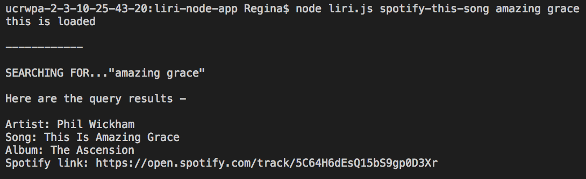
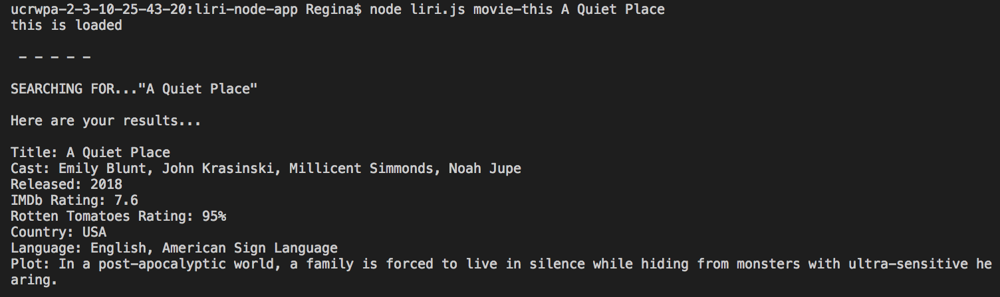
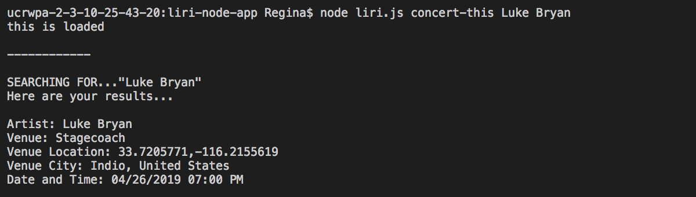

# LIRI NODE APP

## Description

LIRI is a Language Interpretation and Recognition Interface and will be used as a command line node app that takes in parameters and gives you back data. LIRI searches Spotify for songs, Bands in Town for concerts, and OMDB for movies.

## Install
**Install from the command line:**

    git clone git@github.com:regina7361/liri-node-app.git

**Navigate to room of the project, run NPM install**

    npm install

**Initiate package.json**

    npm init -y

## To Run The Program
**To get a list of Spotify songs run the following command:**

    node liri.js spotify-this-song <enter a song choice>

**To get a list of movies from OMDB run the following command:**

    node liri.js movie-this <enter a movie choice>

**To get a list of concerts for your favorite band run the following command:**

    node liri.js concert-this <enter a band choice>

## Languages & tools

- [Node.js](https://nodejs.org/en/)

- [Jquery](https://jquery.com/)

- [Axios](https://github.com/axios/axios)

- [Spotify](https://developer.spotify.com/)